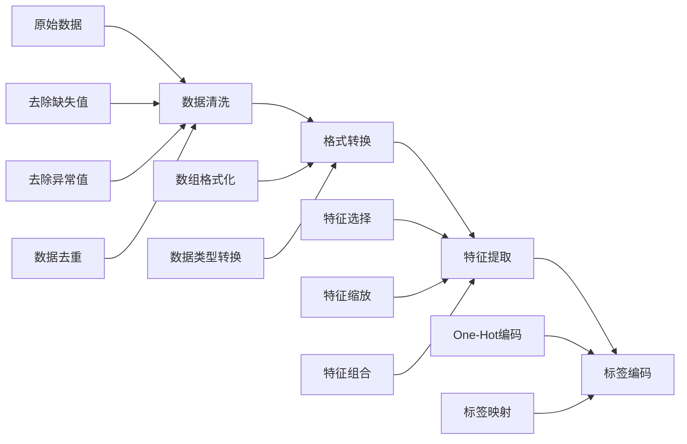
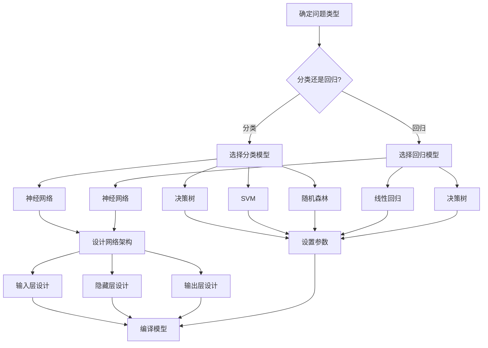
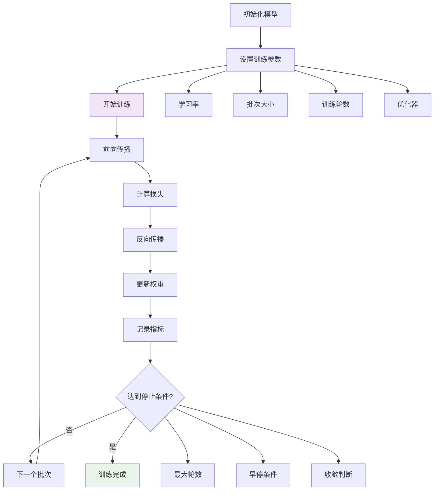
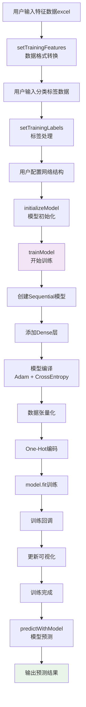

# 基于 TensorFlow.js 的前端分类 AI 系统

## 背景

最近工作中实现了一个需求：Scratch 积木编程实现分类 AI 功能，包括数据处理、神经网络训练、根据模型预测结果和可视化功能。记录一下前端基于 TensorFlow.js 的实现思路。

## 详细步骤说明

### 1. 数据准备阶段



### 2. 模型构建阶段



### 3. 训练优化循环



## 项目的具体实现流程



## 系统架构设计

### 核心技术栈

- **TensorFlow.js**: 提供深度学习能力
- **D3.js**: 实现数据可视化
- **Canvas API**: 渲染决策边界

### 系统组件架构

```typescript
type Data = {
  currentGenerationIndex?: number; // 当前训练次数
  features?: number[][]; // 训练特征矩阵
  labels?: string[]; // 训练标签
  classLabels?: string[]; // 分类枚举
  tempModelMap?: {
    // 模型存储
    [modelId: string]: tf.Sequential;
  };
  probabilities?: number[]; // 预测概率
  classification?: string; // 预测结果
};
```

## 核心功能实现

### 1. 智能数据预处理

系统支持灵活的特征数据输入，自动处理列式到行式的数据转换：

```typescript
setTrainingFeatures(args: BlockArgument) {
  const dynamicArgs = getDynamicArgs<typeof args>(args, 'FEATURES_');

  const featuresList = Object.values(dynamicArgs).map(_features =>
    Array.isArray(_features) ? _features : [Number(_features)]
  );

  // 将列式存储的特征转换为行式存储 [feature1_array, feature2_array] → [[sample1_f1, sample1_f2], ...]
  // [5.1, 4.9, 5.9], [3.5, 3, 3] => [[5.1, 3.5],[4.9, 3.0],[5.9, 3.0]]
  this.blockData.features = featuresList[0].map((_, i) =>
    featuresList.map(arr => Number(arr[i]))
  );
}
```

### 2. 可配置神经网络架构

系统允许用户自定义网络结构，支持多隐藏层配置：

```typescript
async trainModel(args: { MODEL: string }) {
  const model = tf.sequential();

  // 输入层 - 自适应特征维度
  model.add(tf.layers.dense({
    units: features[0].length * 2, // 神经元为特征数量的两倍
    inputShape: [features[0].length],
    activation: 'relu'
  }));

  // 隐藏层 - 用户可配置
  for (let i = 1; i < hiddenSizes.length; i++) {
    model.add(tf.layers.dense({
      units: hiddenSizes[i],
      activation: 'relu'
    }));
  }

  // 输出层 - 自适应类别数
  model.add(tf.layers.dense({
    units: classLabels.length,
    activation: 'softmax'
  }));
}
```

**关键特性：**

- 动态网络结构：根据输入特征和输出类别自适应
- ReLU 激活函数：解决梯度消失问题
- Softmax 输出：多分类概率分布

### 3. 高效训练流程

采用现代深度学习最佳实践：

```typescript
// 模型编译
model.compile({
  optimizer: tf.train.adam(), // Adam优化器
  loss: "categoricalCrossentropy", // 多分类损失函数
  metrics: ["accuracy"], // 准确率监控
});

// One-Hot编码
const label2Index = Object.fromEntries(classLabels.map((v, i) => [v, i]));
const ys = tf.oneHot(
  tf.tensor1d(
    labels.map((l) => label2Index[l]),
    "int32"
  ),
  classLabels.length
);

// 训练执行
await model.fit(xs, ys, {
  epochs: 20,
  verbose: 0,
  shuffle: true, // 样本随机打乱，提高收敛
  validationSplit: 0.2,
  callbacks: {
    onEpochEnd: (epoch, logs) => {
      // 实时可视化更新
      this.updateVisualization(model, epoch);
    },
  },
});
```

### 4. 智能预测系统

结果预测

```typescript
predictWithModel(args: BlockArgument) {
  const inputFeatures = Object.values(dynamicArgs).map(feature => Number(feature));

  const predictions = this.blockData.tempModelMap[args.MODEL].predict(
    tf.tensor2d([inputFeatures])
  ) as tf.Tensor;

  const probabilities = predictions.dataSync(); // 每个结果的概率
  const maxIndex = probabilities.indexOf(Math.max(...probabilities));
  const classification = this.blockData.classLabels[maxIndex];

  this.blockData.probabilities = Array.from(probabilities);
  this.blockData.classification = classification;

  predictions.dispose(); // 内存管理
}
```

## 可视化系统


### 1. 训练数据散点图

使用 D3.js 创建交互式散点图：

```typescript
drawScatterPlot(options: {
  features: number[][];
  labels: string[];
  classLabels: string[];
}) {
  const svg = d3.select(container).append('svg');
  const color = d3.scaleOrdinal().domain(classLabels).range(d3.schemeCategory10);

  svg.selectAll('circle')
    .data(features.map((f, i) => ({ x: f[0], y: f[1], label: labels[i] })))
    .enter().append('circle')
    .attr('cx', d => xScale(d.x))
    .attr('cy', d => yScale(d.y))
    .attr('fill', d => color(d.label));
}
```

### 2. 实时决策边界渲染

通过 Canvas API 实现高性能决策边界可视化：

```typescript
drawDecisionBoundary(options: { model: tf.Sequential }) {
  const canvas = document.createElement('canvas');
  const ctx = canvas.getContext('2d');

  // 批量预测网格点
  const allInputs = [];
  for (let py = 0; py < plotHeight; py++) {
    for (let px = 0; px < plotWidth; px++) {
      const fx = xScale.invert(px + margin.left);
      const fy = yScale.invert(py + margin.top);
      allInputs.push([fx, fy, ...featureMeans.slice(2)]);
    }
  }

  // 一次性推理优化性能
  const inputTensor = tf.tensor2d(allInputs);
  const probsTensor = model.predict(inputTensor) as tf.Tensor;
  const probsArr = probsTensor.dataSync();

  // 渲染像素
  this.renderDecisionBoundaryImage(ctx, classIndexMatrix, color);
}
```

## 系统优势

- **直观可视化**: 实时展示训练过程和决策边界
- **模块化设计**: 每个功能独立，便于理解
- **即时反馈**: 训练和预测结果立即可见
- **前端 AI**: 完全在浏览器中运行，无需服务器

## 性能优化策略

### 1. 内存管理

```typescript
// 及时释放张量资源
xs.dispose();
ys.dispose();
predictions.dispose();
```

### 2. 批量处理

```typescript
// 批量预测替代逐点预测
const inputTensor = tf.tensor2d(allInputs);
const probsTensor = model.predict(inputTensor) as tf.Tensor;
```

### 3. Canvas 优化

```typescript
// 预缓存颜色避免重复计算
const colorCache = {};
for (let i = 0; i < 20; ++i) {
  const c = d3.color(color(i));
  if (c) colorCache[i] = [c.r, c.g, c.b, 180];
}
```
